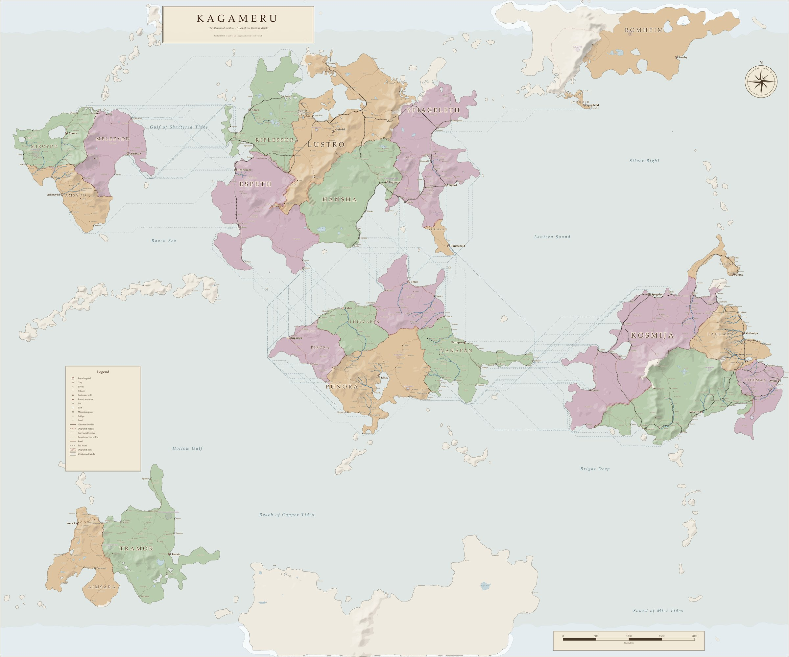

<div align="center">
  <h1>The Mirrored Realms</h1>
  <p><strong>An evolving campaign setting of living reflections, broken time, folded space, and divine scars.</strong></p>
  <p>
    <code>5.5e compatible</code> ·
    <code>SRD 5.2.1</code> ·
    <code>CC BY 4.0</code> ·
    <code>Obsidian vault</code> ·
    <code>Atlas VTT ready</code> ·
    <code>active development</code>
  </p>
  <p>
    <a href="https://shadowokami.com/MirrorGate">Project website</a> ·
    <a href="00%20Library%20of%20Kagami/Welcome.md">Enter the library</a> ·
    <a href="#getting-started">Getting started</a> ·
    <a href="#release-roadmap">Roadmap</a> ·
    <a href="#contributing">Contributing</a> ·
    <a href="#license-and-attribution">License</a>
  </p>
</div>

---

> [!IMPORTANT]
> **The Mirrored Realms is in early development.** The setting is growing, but it is not yet a complete, ready-to-run campaign. Lore, mechanics, names, maps, and planned releases may change during writing and playtesting.

## Contents

- [About the Setting](#about-the-setting)
- [The Known World](#the-known-world)
- [Getting Started](#getting-started)
- [Repository Layout](#repository-layout)
- [Reading the Vault](#reading-the-vault)
- [Rules and Game Material](#rules-and-game-material)
- [Playing at the Table](#playing-at-the-table)
- [Release Roadmap](#release-roadmap)
- [How This World Is Made](#how-this-world-is-made)
- [Contributing](#contributing)
- [Credits](#credits)
- [License and Attribution](#license-and-attribution)

## About the Setting

**The Mirrored Realms** is both the name of this project and of its fifth-edition campaign setting. Its central world, **Kagameru**, still bears the wounds of an ancient divine war. Roads can arrive in the wrong century, ruins remember histories that never happened, and mirrors sometimes open toward places no map can contain.

The project combines setting lore, characters, factions, creatures, homebrew rules, and playable adventures in one interconnected archive. It supports one-shots, short multishot adventures, and long-form campaigns without requiring every table to follow the same version of history.

| At a glance | |
| --- | --- |
| **World** | Kagameru |
| **Central mystery** | the Mirrorgate and the Scars of the Primordial War |
| **Present age** | the Shattered Hope Era |
| **Main campaign** | Shattered Hope (CF-01) |
| **Rules foundation** | fifth edition, using the System Reference Document 5.2.1 |
| **Format** | Obsidian vault of linked Markdown notes |
| **Virtual tabletop** | Atlas VTT (optional) |
| **License** | CC BY 4.0 for original project material |

## The Known World

<p align="center">
  
</p>

<details>
<summary><strong>View the political map</strong></summary>
<p align="center">
  
</p>
</details>

> [!WARNING]
> **This is an early version of the world map.** Coastlines, borders, realms, and the positions of places may still change wherever they do not fit the stories being written. When the map and the stories disagree, the stories decide.

The maps are generated by the project's own cartography scripts from a single seed (`27182818`), which simulate terrain, erosion, climate, and biomes before placing rivers, realms, settlements, roads, and railways.

| Property | Value |
| --- | --- |
| Extent | 12,000 × 10,000 km |
| Projection | flat, origin at the north-west corner; x runs east, y runs south |
| Full resolution | 12,000 × 10,000 px (1 px ≈ 1 km) |
| Images in this repository | 2,400 px wide copies in `z_Assets/` |
| Source files | kept locally in `Cartography/`; not published, because the full-size renders exceed 20 MB each |

## Getting Started

### Requirements

- [Obsidian](https://obsidian.md/) **1.8.7 or newer**. Reading the vault works on any platform; Atlas VTT and Enhancing Export are desktop-only.
- *Optional:* [Pandoc](https://pandoc.org/), if you want to export notes or books with Enhancing Export.

### Opening the Vault

1. Clone or download the repository.

   ```shell
   git clone https://github.com/ShadowOkami4/Mirrorgate.git
   ```

2. Open the repository folder as a vault in Obsidian.
3. When Obsidian asks, trust the vault's community plugins so that its layout, callouts, and tools work as intended.
4. Open [`00 Library of Kagami/Welcome.md`](00%20Library%20of%20Kagami/Welcome.md) and follow whichever record catches your attention.

> [!NOTE]
> Internal links such as `[[The Mirrorgate]]` are written for Obsidian and do not resolve on GitHub. The navigation links in this README use relative paths and work in both.

### Included Plugins and Settings

The shared vault settings in `.obsidian/` enable the following community plugins. None of them is required to read the notes as plain Markdown.

| Plugin | Purpose in this vault |
| --- | --- |
| Atlas VTT | battle maps, tokens, fog of war, dice, initiative, and a player view |
| Dataview | queries over note properties |
| Dice Roller | inline dice rolls in notes |
| Enhancing Export | export of notes and books to PDF, DOCX, and other formats (requires Pandoc) |
| Pixel Banner | banner images at the top of notes |
| Hover Editor | reading and editing linked notes in pop-up windows |
| Advanced Tables | table editing |
| Iconize | folder and note icons |
| Style Settings | options for the theme and CSS snippets |
| Claudian | the maintainer's AI assistant (see [A Note on AI](#a-note-on-ai)); not needed to read or play |

The vault uses the **Encore** theme and the CSS snippet `mirrored-realms`, which styles the collapsible GM callouts.

## Repository Layout

| Path | Contents |
| --- | --- |
| `00 Library of Kagami/` | the entrance to the library |
| `01 Encyclopedia/` | setting lore: cosmology, history, geography, peoples, faiths, factions, and characters |
| `02 Rules Compendium/` | homebrew rules: rules modules, character options, and the bestiary |
| `03 Adventures/` | one-shots, multishots, and campaign frameworks, each laid out as a book |
| `04 Books/` | the bookshelf: tables of contents that arrange library entries into books |
| `90 Scriptorium/` | the project office: roadmap, style, naming, and vault guides; templates; asset register; soundtrack |
| `99 Archive/` | superseded drafts, excluded from the active graph and not canon |
| `z_Assets/` | images |
| `.obsidian/` | shared vault settings, plugins, theme, and snippets |

These paths are excluded from the repository by `.gitignore`:

| Path | Reason |
| --- | --- |
| `atlas-vtt/` | local Atlas VTT data: personal settings, test scenes, and the plugin's third-party starter tokens. The plugin requires this folder at the vault root; never move or rename it. |
| `Cartography/` | map generator and full-size renders, which are too large for the repository |
| `.obsidian/workspace.json` | personal window layout |
| `.claude/`, `.claudian/` | local AI assistant data |

## Reading the Vault

The vault can be read in two ways, and nothing in it is written twice.

- **As a library.** Short, linked entries in the voice of Professor Phineas Phantomhive II, chief chronicler of the Encyclopedia Kagami. Follow links, backlinks, and hub notes in any order.
- **As books.** Tables of contents in `04 Books/` arrange the same entries into a fixed reading order: the [Encyclopedia Kagami](04%20Books/Encyclopedia%20Kagami.md), the [Player's Companion](04%20Books/Player's%20Companion.md), the [Game Master's Codex](04%20Books/Game%20Master's%20Codex.md), and the [Mirrorgate Bestiary](04%20Books/Mirrorgate%20Bestiary.md). Every adventure is a book of its own.

| Subject | Starting record |
| --- | --- |
| Entrance | [Library of Kagami](00%20Library%20of%20Kagami/Welcome.md) |
| World | [Kagameru](01%20Encyclopedia/Kagameru.md) |
| Cosmology | [The Mirrorgate](01%20Encyclopedia/Cosmology/The%20Mirrorgate.md) |
| History | [History & Myths](01%20Encyclopedia/History%20%26%20Myths/History%20%26%20Myths.md) |
| Geography | [Geography & Politics](01%20Encyclopedia/Geography%20%26%20Politics/Geography%20%26%20Politics.md) |
| Peoples | [Species & Cultures](01%20Encyclopedia/Species%20%26%20Cultures/Species%20%26%20Cultures.md) |
| Powers | [People & Powers](01%20Encyclopedia/People%20%26%20Powers/People%20%26%20Powers.md) |
| Rules | [Rules Compendium](02%20Rules%20Compendium/Rules%20Compendium.md) |
| Adventures | [Adventures & Fiction](03%20Adventures/Adventures%20%26%20Fiction.md) |
| Books | [Bookshelf](04%20Books/Bookshelf.md) |
| Conventions | [Vault Guide](90%20Scriptorium/Vault%20Guide.md) · [Style Guide](90%20Scriptorium/Style%20Guide.md) · [Naming Guide](90%20Scriptorium/Naming%20Guide.md) |

### Note Properties

Every note carries YAML front matter. Properties are hidden in the reading view and can be inspected in the Properties panel or in Source mode.

| Property | Values | Meaning |
| --- | --- | --- |
| `type` | `npc`, `location`, `creature`, `adventure-chapter`, `moc`, … | what kind of note it is |
| `status` | `concept`, `announced`, `draft`, `active-draft`, `foundation`, `active` | editorial state |
| `audience` | `shared`, `gm` | whether players can read it safely |
| `canon` | `current`, `superseded` | whether it belongs to the current setting |
| `parent` | a link | the hub the note belongs to |
| `id` | `OS-01`, `SA-01`, `CF-01`, … | stable release identifier |
| `progress` | `0`–`100` | production estimate of a release |
| `release` | a link | the adventure in which a note is used |
| `located-in` | a link | the place containing this one |
| `level`, `cr`, `chapter` | numbers | adventure level, challenge rating, chapter order |

Spoilers inside player-safe notes sit in collapsible callouts marked **GM** (`> [!gm]-`). Players can read a `shared` entry without opening them.

## Rules and Game Material

All rules material targets fifth edition and uses the terminology and stat block format of the **System Reference Document 5.2.1**.

- **Character options**, such as the [Mirrorbound](02%20Rules%20Compendium/Character%20Options/Subclasses/Mirrorbound.md) fighter and [Scarborn Sorcery](02%20Rules%20Compendium/Character%20Options/Subclasses/Scarborn%20Sorcery.md), work in any fifth-edition world. Setting lore is kept in an optional section, *In the Mirrored Realms*.
- **Creatures** use the current stat block layout: AC and Initiative, a combined ability and saving-throw table, `CR x (XP y; PB +z)`, and separate Traits, Actions, Bonus Actions, and Reactions. See the [Mirrorgate Bestiary](04%20Books/Mirrorgate%20Bestiary.md).
- **Rules modules**, such as [Scar Hazards](02%20Rules%20Compendium/Rules%20Modules/Scar%20Hazards.md), keep mechanics out of the lore entries.

> [!NOTE]
> Subclasses, creatures, and rules modules are **playtest drafts**. Numbers may change.

## Playing at the Table

### Atlas VTT

The vault is set up for **[Atlas VTT](https://github.com/ByteMirror/atlas-vtt)** by **Fabian Urbanek** ([ByteMirror](https://github.com/ByteMirror)), a free and open-source Obsidian plugin that turns the vault into a virtual tabletop. It is optional; every note can be read and run without it.

> [!WARNING]
> Atlas VTT stores its data in an `atlas-vtt` folder at the root of the vault. The plugin requires that exact location: **do not move or rename the folder**, or existing maps will break.

Project conventions, creature linking, and what is published to this repository are described in the [Atlas VTT Guide](90%20Scriptorium/Atlas%20VTT%20Guide.md).

### Soundtrack

Every important place and character has a music recommendation, collected on the [Soundtrack](90%20Scriptorium/Soundtrack.md) page. Some are generic moods; others are specific tracks from these games:

| Franchise | Rights holder |
| --- | --- |
| *Celeste* (music by Lena Raine) | © Maddy Makes Games |
| *The Legend of Zelda* | © Nintendo |
| *Super Mario* | © Nintendo |
| *Professor Layton* | © Level-5 |

> [!IMPORTANT]
> **These are only recommendations.** No music is included in this repository. Every named track belongs to its composer and rights holders and is credited on the Soundtrack page. Please listen through official sources.
>
> **Self-made remixes are planned for every track.** Remixes of copyrighted music will only be published where that is permitted, and they are not covered by the project's CC BY 4.0 license.

## Release Roadmap

The planned collection contains **18 journeys**: ten one-shots, five short adventures or multishots, and three campaign frameworks. A title being announced does not mean active development has begun.

| Collection | Planned | Announced | In development |
| --- | ---: | ---: | ---: |
| One-shots | 10 | 2 | 0 |
| Short adventures / multishots | 5 | 3 | 1 |
| Campaigns / campaign frameworks | 3 | 1 | 1 |
| **Total** | **18** | **6** | **2** |

### Current Production

| Release | Kind | State | Progress | Current work |
| --- | --- | --- | ---: | --- |
| [The Pact in the Twilight](03%20Adventures/Multishots/SA-01%20The%20Pact%20in%20the%20Twilight/The%20Pact%20in%20the%20Twilight.md) | short adventure | `ACTIVE DRAFT` | **25%** | Prelude and Chapters 1–3 drafted; outlining the rest of the adventure |
| [Shattered Hope](03%20Adventures/Campaigns/CF-01%20Shattered%20Hope/Shattered%20Hope.md) | main campaign | `FOUNDATION` | **1%** | defining the campaign spine and its major arcs |

<details>
<summary><strong>View current development milestones</strong></summary>

#### The Pact in the Twilight

- [x] Draft the opening premise, forest journey, and meeting with Sandra
- [x] Draft the first chapters: the road north, the temple, and the sanctum behind the mirror
- [ ] **Complete the adventure outline and chapter structure — current work**
- [ ] Add encounters, maps, creature statistics, and consequences
- [ ] Add rewards, scaling, and Game Master guidance
- [ ] Playtest, revise, and prepare the adventure for release

#### Shattered Hope

- [x] Establish the era, tone, and central campaign question
- [ ] **Define the campaign spine and major arcs — current work**
- [ ] Assign factions, antagonists, and major locations to each arc
- [ ] Design the adventure sequence, encounters, and rewards
- [ ] Playtest, revise, and prepare the campaign framework for release

</details>

> [!NOTE]
> Progress percentages are editorial estimates, not release dates. They describe how much of the intended finished work has been drafted, revised, and prepared for playtesting.

<details>
<summary><strong>View the full release catalogue</strong></summary>

#### Status Key

| State | Meaning |
| --- | --- |
| `UNANNOUNCED` | a reserved roadmap slot without a public title |
| `ANNOUNCED` | the title and premise are public, but active development has not begun |
| `FOUNDATION` | core structure and campaign architecture are being established |
| `ACTIVE DRAFT` | playable material is currently being written |

#### One-shots — 10 planned

| ID | Title | State | Notes |
| --- | --- | --- | --- |
| OS-01 | [**The Dark Alley**](03%20Adventures/One-Shots/OS-01%20The%20Dark%20Alley/The%20Dark%20Alley.md) | `ANNOUNCED` | a complete rewrite of an older original one-shot, rebuilt to fit the Mirrored Realms |
| OS-02 | [**Mirror and Scars**](03%20Adventures/One-Shots/OS-02%20Mirror%20and%20Scars/Mirror%20and%20Scars.md) | `ANNOUNCED` | an episodic series whose episodes can each be played on their own; the series occupies one slot |
| OS-03 – OS-10 | — | `UNANNOUNCED` | |

#### Short Adventures / Multishots — 5 planned

| ID | Title | State | Notes |
| --- | --- | --- | --- |
| SA-01 | [**The Pact in the Twilight**](03%20Adventures/Multishots/SA-01%20The%20Pact%20in%20the%20Twilight/The%20Pact%20in%20the%20Twilight.md) | `ACTIVE DRAFT` · **25%** | the first short adventure in active development |
| SA-02 | [**Confronting Yourself**](03%20Adventures/Multishots/SA-02%20Confronting%20Yourself/Confronting%20Yourself.md) | `ANNOUNCED` | development has not begun |
| SA-03 | [**The Mysteries of the Phantomhives**](03%20Adventures/Multishots/SA-03%20The%20Mysteries%20of%20the%20Phantomhives/The%20Mysteries%20of%20the%20Phantomhives.md) | `ANNOUNCED` | development has not begun |
| SA-04 – SA-05 | — | `UNANNOUNCED` | |

#### Campaigns / Campaign Frameworks — 3 planned

| ID | Title | State | Notes |
| --- | --- | --- | --- |
| CF-01 | [**Shattered Hope**](03%20Adventures/Campaigns/CF-01%20Shattered%20Hope/Shattered%20Hope.md) | `FOUNDATION` · **1%** | the main campaign of the Mirrored Realms |
| CF-02 – CF-03 | — | `UNANNOUNCED` | |

</details>

### Development Principles

- **Playability before volume:** a smaller finished adventure is more valuable than many disconnected drafts.
- **Mystery with usable answers:** players may encounter uncertainty, but Game Masters should receive enough truth to run the setting confidently.
- **Connected, not linear:** records reward curiosity and cross-reference related lore without demanding a fixed reading order.
- **Open by design:** tables may reuse, alter, publish, and build upon original project material under CC BY 4.0.
- **Revision is expected:** early concepts may change when stronger ideas emerge through writing, feedback, and playtesting.

## How This World Is Made

The Mirrored Realms is created by **Okami**. The world has been in the making for about two years, and many earlier versions were written, played with, and scrapped before this one.

**The storytelling is made by human hand, and it will stay that way.** The world's vision, its history, its characters, how the stories unfold, and where they are going are planned and written by Okami.

### A Note on AI

I will not hide or lie about it: I use AI. [Claude](https://claude.ai), an AI assistant by Anthropic, helps me as a tool in a few limited areas:

- checking that the world map and the written lore agree with each other;
- checking grammar and spelling;
- minor help with balancing the game mechanics of subclasses, monsters, and items;
- organizing the vault and rewording existing entries from my own notes and ideas.

What I will not use AI for is the story itself. The plot, the characters, the direction of the adventures, and the vision of the world come from me. This world has taken years and many scrapped versions to grow into what it is, and I don't want that vision replaced by AI. Where AI has helped with wording, the story decisions behind it are still mine, and anything that does not match my vision gets rewritten.

## Contributing

Corrections, playtest reports, writing, mechanics, and original artwork are welcome through [GitHub Issues](https://github.com/ShadowOkami4/Mirrorgate/issues) and pull requests.

1. Open an issue describing the correction, idea, or playtest report.
2. For changes to the vault, fork the repository, make your edits in Obsidian, and open a pull request.
3. Follow the [Style Guide](90%20Scriptorium/Style%20Guide.md) and [Naming Guide](90%20Scriptorium/Naming%20Guide.md), use the templates in `90 Scriptorium/Templates/`, and give every new note complete front matter.
4. Move or rename notes inside Obsidian so that links update; never move the `atlas-vtt` folder.

By contributing original material, you agree to make it available under the project's [CC BY 4.0 license](LICENSE). You keep authorship and receive credit for accepted work. Submit only material you created or have the right to release under those terms, and do not submit protected text, artwork, characters, or settings from games and fictional universes you do not control.

### Artwork and Artist Contributions

> [!NOTE]
> AI-generated images are currently used as visual aids, concept references, and temporary representations during development. They are not intended to discourage or replace contributions from artists. The [Asset Register](90%20Scriptorium/Asset%20Register.md) records the status of every image.

Artists are invited to propose original character art, creatures, locations, maps, symbols, items, or other visual interpretations of the Mirrored Realms. Suitable original artwork may replace temporary visual references over time, and every accepted work will credit its artist wherever practical.

**Volunteer art and paid proposals.** Artists may offer work voluntarily or propose a paid commission. **Requests for payment are welcome, but payment cannot be promised.** Budget, scope, schedule, attribution, delivery files, and usage rights must be agreed before commissioned work begins. A suggestion, portfolio, or unsolicited finished piece does not create a payment obligation.

**Credit and open licensing.** Artwork in this repository must be original, and the artist must have the right to release it under [CC BY 4.0](LICENSE). Payment for a commission does not remove the artist's right to be credited.

To propose artwork, open an [artwork proposal issue](https://github.com/ShadowOkami4/Mirrorgate/issues) with:

- the subject or part of the setting you want to illustrate;
- a short description of the proposed work;
- a portfolio or relevant examples, if available;
- your preferred artist credit and links;
- whether the proposal is voluntary or requests payment; and
- any schedule, format, or accessibility considerations.

## Credits

**The Mirrored Realms** — world, story, and adventures — is created by **Okami**.

**Atlas VTT** — the virtual tabletop plugin this vault is set up for — is created by **Fabian Urbanek** ([ByteMirror](https://github.com/ByteMirror)). It began as part of his bachelor's thesis, with the goal of giving the tabletop community a virtual tabletop that is open source, hackable, and free to use. Many thanks for making it. If you enjoy playing the Mirrored Realms with Atlas VTT, consider starring or supporting the [Atlas VTT project](https://github.com/ByteMirror/atlas-vtt).

## License and Attribution

| Material | License |
| --- | --- |
| Original Mirrored Realms material (text, rules, maps) | [CC BY 4.0](LICENSE) |
| Material from the System Reference Document 5.2.1 | CC BY 4.0, by Wizards of the Coast LLC |
| Obsidian plugins and themes in `.obsidian/` | their own licenses; Atlas VTT is licensed under the GNU AGPL |
| Recommended music | not included; all rights remain with the rights holders |
| AI-assisted images in `z_Assets/` | see the [Asset Register](90%20Scriptorium/Asset%20Register.md) |

Except where stated otherwise, original material created for **The Mirrored Realms** may be copied, adapted, redistributed, published, and used commercially with appropriate credit. A simple attribution names **The Mirrored Realms** and links to the [project website](https://shadowokami.com/MirrorGate) or this repository.

See [NOTICE.md](NOTICE.md) for a ready-to-use attribution statement, the required SRD 5.2.1 notice, and third-party exclusions.

---

<div align="center">
  <p><em>The realm is unfinished. Its possibilities are not.</em></p>
</div>
