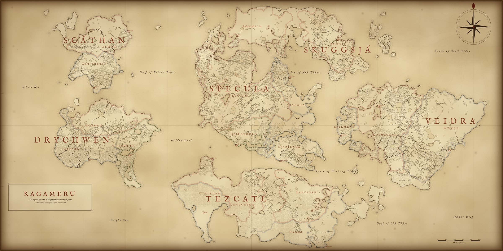

<div align="center">
  <h1>The Mirrored Realms</h1>
  <p><strong>An evolving campaign setting of living reflections, broken time, folded space, and divine scars.</strong></p>
  <p>
    <code>5.5e compatible</code> ·
    <code>openly licensed</code> ·
    <code>Obsidian vault</code> ·
    <code>active development</code>
  </p>
  <p>
    <a href="https://shadowokami.com/MirrorGate">Project website</a> ·
    <a href="00%20Project/Welcome.md">Enter the archive</a> ·
    <a href="#release-roadmap">Release roadmap</a> ·
    <a href="#contributing">Contributing</a> ·
    <a href="LICENSE">License</a>
  </p>
</div>

---

> [!IMPORTANT]
> **The Mirrored Realms is in early development.** The setting is growing, but it is not yet a complete ready-to-run campaign. Lore, mechanics, names, and planned releases may change during writing and playtesting.

## Welcome to the Mirrored Realms

**The Mirrored Realms** is the name of both this project and its 5.5e-compatible campaign setting. Its central world, **Kagameru**, still bears the wounds of an ancient divine war. Roads can arrive in the wrong century, ruins remember histories that never happened, and mirrors sometimes open toward places no map can contain.

The project combines setting lore, characters, factions, creatures, homebrew mechanics, and playable adventures in an interconnected archive. It is designed to support individual one-shots, short multishot adventures, and long-form campaigns without requiring every table to follow the same version of history.

| At a glance | |
| --- | --- |
| **World** | Kagameru |
| **Central mystery** | The Mirrorgate and the Scars of the Primordial War |
| **Main campaign** | Shattered Hope |
| **Rules foundation** | 5.5e-compatible material using SRD 5.2.1 |
| **Project format** | Interconnected Obsidian vault |
| **License** | CC BY 4.0 for original project material |

## The Known World

<p align="center">
  
</p>

> [!WARNING]
> **This is an early version of the world map.** Coastlines, borders, realms, and the positions of places may still change wherever they do not fit the stories being written. When the map and the stories disagree, the stories decide.

## Explore the Archive

The vault is meant to be explored through connected records rather than read strictly from beginning to end. Its folders provide broad project layers, while hub notes, properties, backlinks, and graph view reveal the relationships between people, places, lore, and releases. The same records can also be read in order as books—a setting guide, a player's companion, a Game Master's codex, a bestiary, and one book per adventure—from the [Bookshelf](04%20Books/Bookshelf.md). The [Vault Guide](90%20Scriptorium/Vault%20Guide.md) explains the shared conventions.

| Subject | Starting record |
| --- | --- |
| Entrance | [Library of Kagami](00%20Library%20of%20Kagami/Welcome.md) |
| Vault navigation | [Vault Guide](90%20Scriptorium/Vault%20Guide.md) · [Roadmap](90%20Scriptorium/Roadmap.md) |
| World | [Kagameru](01%20Encyclopedia/Kagameru.md) |
| Cosmology | [The Mirrorgate](01%20Encyclopedia/Cosmology/The%20Mirrorgate.md) |
| History | [History & Myths](01%20Encyclopedia/History%20%26%20Myths/History%20%26%20Myths.md) |
| Geography | [Geography & Politics](01%20Encyclopedia/Geography%20%26%20Politics/Geography%20%26%20Politics.md) |
| Peoples | [Species & Cultures](01%20Encyclopedia/Species%20%26%20Cultures/Species%20%26%20Cultures.md) |
| Powers | [People & Powers](01%20Encyclopedia/People%20%26%20Powers/People%20%26%20Powers.md) |
| Rules | [Rules Compendium](02%20Rules%20Compendium/Rules%20Compendium.md) |
| Adventures | [Adventures & Fiction](03%20Adventures/Adventures%20%26%20Fiction.md) |
| Play | [Atlas VTT Guide](90%20Scriptorium/Atlas%20VTT%20Guide.md) |
| Books | [Bookshelf](04%20Books/Bookshelf.md) · [Player's Companion](04%20Books/Player's%20Companion.md) · [Game Master's Codex](04%20Books/Game%20Master's%20Codex.md) |

### Open the Project in Obsidian

1. Clone or download the repository.

   ```shell
   git clone https://github.com/ShadowOkami4/Mirrorgate.git
   ```

2. Open the repository folder as a vault in [Obsidian](https://obsidian.md/).
3. When Obsidian asks, trust the vault's community plugins so that its layout, callouts, and tools work as intended.
4. Open [00 Library of Kagami/Welcome.md](00%20Library%20of%20Kagami/Welcome.md) and follow whichever record catches your attention.

> [!NOTE]
> Internal links such as `[[The Mirrorgate]]` are written for Obsidian. The navigation links in this README also work directly on GitHub.

### Play It as a Virtual Tabletop

The vault is set up for **[Atlas VTT](https://github.com/ByteMirror/atlas-vtt)** by **Fabian Urbanek** ([ByteMirror](https://github.com/ByteMirror)), a free and open-source Obsidian plugin that adds battle maps, tokens, fog of war, dice, initiative, and a separate player window. It requires Obsidian 1.8.7 or newer on desktop. Atlas VTT is optional—every note can be read and run without it.

> [!WARNING]
> Atlas VTT stores its data in an `atlas-vtt` folder at the root of the vault. The plugin requires that exact location: **do not move or rename the folder**, or existing maps will break.

Project conventions, creature linking, and what is published to this repository are described in the [Atlas VTT Guide](90%20Scriptorium/Atlas%20VTT%20Guide.md).

## Release Roadmap

The planned collection contains **18 journeys**: ten one-shots, five short adventures or multishots, and three campaign frameworks. A title being announced does not mean active development has begun.

| Collection | Planned | Announced | In development |
| --- | ---: | ---: | ---: |
| One-shots | 10 | 2 | 0 |
| Short adventures / multishots | 5 | 3 | 1 |
| Campaigns / campaign frameworks | 3 | 1 | 1 |
| **Total** | **18** | **6** | **2** |

### Current Production

| [Shattered Hope](03%20Adventures/Campaigns/CF-01%20Shattered%20Hope/Shattered%20Hope.md) | [The Pact in the Twilight](The%20Pact%20in%20the%20Twilight.md) |
| --- | --- |
| **Main campaign · 1%** | **Short adventure / multishot · 5%** |
| `FOUNDATION` | `ACTIVE DRAFT` |
| Defining the campaign spine and its major arcs | Expanding the prelude into a complete adventure outline |

<details>
<summary><strong>View current development milestones</strong></summary>

#### Shattered Hope

- [x] Establish the era, tone, and central campaign question
- [ ] **Define the campaign spine and major arcs — current work**
- [ ] Assign factions, antagonists, and major locations to each arc
- [ ] Design the adventure sequence, encounters, and rewards
- [ ] Playtest, revise, and prepare the campaign framework for release

#### The Pact in the Twilight

- [x] Draft the opening premise, forest journey, and meeting with Sandra
- [ ] **Complete the adventure outline and chapter structure — current work**
- [ ] Add encounters, maps, creature statistics, and consequences
- [ ] Add rewards, scaling, and Game Master guidance
- [ ] Playtest, revise, and prepare the adventure for release

</details>

> [!NOTE]
> Progress percentages are editorial estimates, not release dates. They describe how much of the intended finished work has been drafted, revised, and prepared for playtesting.

### Status Key

| State | Meaning |
| --- | --- |
| `UNANNOUNCED` | A reserved roadmap slot without a public title |
| `ANNOUNCED` | The title and premise are public, but active development has not begun |
| `FOUNDATION` | Core structure and campaign architecture are being established |
| `ACTIVE DRAFT` | Playable material is currently being written |

### One-shots — 10 planned

| ID | Title | State | Notes |
| --- | --- | --- | --- |
| OS-01 | [**The Dark Alley**](03%20Adventures/One-Shots/OS-01%20The%20Dark%20Alley/The%20Dark%20Alley.md) | `ANNOUNCED` | A complete rewrite of an older original one-shot, rebuilt to fit The Mirrored Realms |
| OS-02 | [**Mirror and Scars**](03%20Adventures/One-Shots/OS-02%20Mirror%20and%20Scars/Mirror%20and%20Scars.md) | `ANNOUNCED` | An episodic series whose chapters can each be played independently; the complete series occupies one roadmap slot |
| OS-03 | — | `UNANNOUNCED` | |
| OS-04 | — | `UNANNOUNCED` | |
| OS-05 | — | `UNANNOUNCED` | |
| OS-06 | — | `UNANNOUNCED` | |
| OS-07 | — | `UNANNOUNCED` | |
| OS-08 | — | `UNANNOUNCED` | |
| OS-09 | — | `UNANNOUNCED` | |
| OS-10 | — | `UNANNOUNCED` | |

### Short Adventures / Multishots — 5 planned

| ID    | Title                                                                                                                                                              | State                   | Notes                                           |
| ----- | ------------------------------------------------------------------------------------------------------------------------------------------------------------------ | ----------------------- | ----------------------------------------------- |
| SA-01 | [**The Pact in the Twilight**](The%20Pact%20in%20the%20Twilight.md)                            | `ACTIVE DRAFT` · **5%** | The first short adventure in active development |
| SA-02 | [**Confronting Yourself**](03%20Adventures/Multishots/SA-02%20Confronting%20Yourself/Confronting%20Yourself.md)                                                    | `ANNOUNCED`             | Development has not begun                       |
| SA-03 | [**The Mysteries of the Phantomhives**](03%20Adventures/Multishots/SA-03%20The%20Mysteries%20of%20the%20Phantomhives/The%20Mysteries%20of%20the%20Phantomhives.md) | `ANNOUNCED`             | Development has not begun                       |
| SA-04 | —                                                                                                                                                                  | `UNANNOUNCED`           |                                                 |
| SA-05 | —                                                                                                                                                                  | `UNANNOUNCED`           |                                                 |

### Campaigns / Campaign Frameworks — 3 planned

| ID | Title | State | Notes |
| --- | --- | --- | --- |
| CF-01 | [**Shattered Hope**](03%20Adventures/Campaigns/CF-01%20Shattered%20Hope/Shattered%20Hope.md) | `FOUNDATION` · **1%** | The main campaign of The Mirrored Realms |
| CF-02 | — | `UNANNOUNCED` | |
| CF-03 | — | `UNANNOUNCED` | |

## Development Principles

- **Playability before volume:** A smaller finished adventure is more valuable than many disconnected drafts.
- **Mystery with usable answers:** Players may encounter uncertainty, but Game Masters should receive enough truth to run the setting confidently.
- **Connected, not linear:** Records should reward curiosity and cross-reference related lore without demanding a fixed reading order.
- **Open by design:** Tables may reuse, alter, publish, and build upon original project material under CC BY 4.0.
- **Revision is expected:** Early concepts may change when stronger ideas emerge through writing, feedback, and playtesting.

## How This World Is Made

The Mirrored Realms is created by **Okami**. The world has been in the making for about two years, and many earlier versions were written, played with, and scrapped before this one.

**The storytelling is made by human hand, and it will stay that way.** The world's vision, its history, its characters, how the stories unfold, and where they are going are planned and written by Okami.

### A Note on AI

I will not hide or lie about it: I use AI. [Claude](https://claude.ai), an AI assistant by Anthropic, helps me as a tool in a few limited areas:

- checking that the world map and the written lore agree with each other;
- checking grammar and spelling;
- minor help with balancing the game mechanics of subclasses, monsters, and items;
- organizing the vault and rewording existing entries from my own notes and ideas.

What I will not use AI for is the story itself. The plot, the characters, the direction of the adventures, and the vision of the world come from me. This world has taken years and many scrapped versions to grow into what it is, and I don't want that vision replaced by AI. Where AI has helped with wording, the story decisions behind it are still mine, and anything that does not match my vision gets rewritten.

## Contributing

Corrections, playtest reports, writing, mechanics, and original artwork are welcome through [GitHub Issues](https://github.com/ShadowOkami4/Mirrorgate/issues) and pull requests.

By contributing original material to this repository, you agree to make that contribution available under the project's [CC BY 4.0 license](LICENSE). You retain authorship and receive credit for accepted work. Please submit only material you created or have the right to release under those terms.

Do not submit protected text, artwork, characters, settings, or other material from games and fictional universes that you do not control.

## Artwork and Artist Contributions

> [!NOTE]
> AI-generated images are currently used as visual aids, concept references, and temporary representations during development. They help communicate characters, locations, creatures, and atmosphere. They are not intended to discourage or replace contributions from artists. The vault's [Asset Register](90%20Scriptorium/Asset%20Register.md) records their current status.

Artists are invited to propose original character art, creatures, locations, maps, symbols, items, or other visual interpretations of The Mirrored Realms. Suitable original artwork may replace temporary visual references over time. Every accepted work will identify and credit its artist wherever practical.

### Volunteer Art and Paid Proposals

Artists may offer work voluntarily or propose a paid commission. **Requests for payment are welcome, but payment cannot be promised.** Available budget, project needs, scope, schedule, attribution, delivery files, and usage rights must all be agreed upon before commissioned work begins.

An artwork suggestion, portfolio submission, or unsolicited finished piece does not create a payment obligation. Artists should not begin work expecting payment until a separate written agreement has been accepted by both the artist and the project owner.

### Credit and Open Licensing

Artwork included in this open repository must be original material the artist has the right to share and must be releasable under [CC BY 4.0](LICENSE). This allows the setting and its artwork to be reused and adapted while preserving attribution. Payment for a commission does not remove the artist's right to be credited.

To propose artwork, open an [artwork proposal issue](https://github.com/ShadowOkami4/Mirrorgate/issues) containing:

- the subject or part of the setting you want to illustrate;
- a short description of the proposed work;
- a portfolio or relevant examples, if available;
- your preferred artist credit and links;
- whether the proposal is voluntary or requests payment; and
- any schedule, format, or accessibility considerations.

Please do not submit finished unsolicited work that cannot be released under the project's license.

## Credits

**The Mirrored Realms** — world, story, and adventures — is created by **Okami**.

**Atlas VTT** — the virtual tabletop plugin this vault is set up for — is created by **Fabian Urbanek** ([ByteMirror](https://github.com/ByteMirror)). It began as part of his bachelor's thesis, with the goal of giving the tabletop community a virtual tabletop that is open source, hackable, and free to use. Many thanks for making it. If you enjoy playing the Mirrored Realms with Atlas VTT, consider starring or supporting the [Atlas VTT project](https://github.com/ByteMirror/atlas-vtt).

## License and Attribution

Except where explicitly stated otherwise, original material created for **The Mirrored Realms** is licensed under the [Creative Commons Attribution 4.0 International License](LICENSE). It may be copied, adapted, redistributed, published, and used commercially with appropriate credit.

A simple attribution can identify **The Mirrored Realms** and link to either the [project website](https://shadowokami.com/MirrorGate) or this repository. See [NOTICE.md](NOTICE.md) for a ready-to-use attribution statement, the required SRD 5.2.1 notice, and third-party exclusions.

---

<div align="center">
  <p><em>The realm is unfinished. Its possibilities are not.</em></p>
</div>
